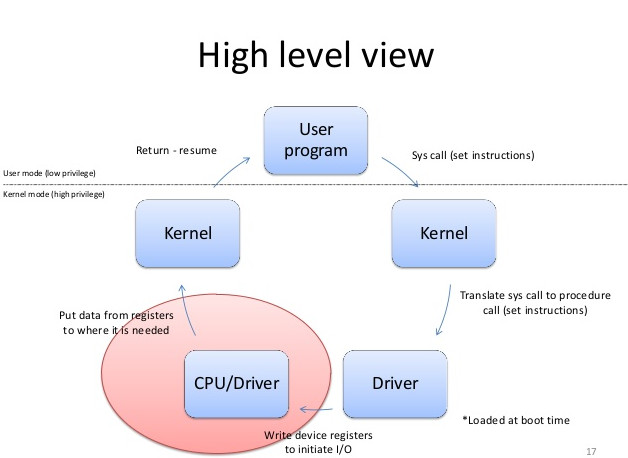

|              |                |
|    :---      |      ---:      |
| Nombre: Kevin Martin Samayoa Urizar | Curso: Sistemas Operativos 1 |
| Carnet: 200915348                   | Fecha: 28/08/2024            |

# ACTIVIDAD 5

## Tipos de kernel y sus diferencias

Tipos de kernel:
* Monolítico: El kernel completo opera como una
única unidad en espacio de núcleo. Linux es un
ejemplo de un kernel monolítico.

* Microkernel: Solo las funciones esenciales
residen en el espacio de núcleo, mientras que
servicios adicionales se ejecutan en el espacio
de usuario. Esto puede proporcionar mayor
modularidad y flexibilidad.

* Híbrido: Combina características de los kernels
monolíticos y microkernels para lograr un
equilibrio entre rendimiento y modularidad.

* Exokernel: Se encarga únicamente de asignar los 
recursos del hardware a los diferentes programas 
en ejecución. Los programas tienen un control completo 
sobre los recursos asignados, lo que les permite 
aprovechar al máximo el hardware. Su rendimiento es
excepcional, pero es muy complejo de implementar
y puede requerir modificaciones significativas en las 
aplicaciones existentes.

|              |   Ventajas   |  Desventajas   |
|    :---:     |     :---:    |     :---:      |
| Monolítico   | * Rendimiento   * Simplicidad | * Menor modularidad.   * Menos robusto (un fallo puede afectar todo el sistema). |
| Microkernel  | * Mayor modularidad   * Mejor mantenibilidad | * Mantenimiento ligeramente menor   * Complejidad |
| Híbrido      | * Flexibilidad   * Buena escalabilidad | Complejidad |
| Exokernel    | * Mayor control   * Rendimiento | * Mayor complejidad para aplicaciones.   * Menor portabilidad (por la gestión directa de recursos puede ser menos portable entre diferentes hardware). |

## User vs Kernel Mode
Modo usuario: Cuando un programa o una aplicación se está ejecutando en modo de usuario, tiene un conjunto limitado de privilegios y accesos a recursos del sistema. 

Caracteristicas:
* Las instrucciones ejecutadas en este modo no pueden acceder directamente a hardware o recursos críticos del sistema.
* Se utiliza para ejecutar aplicaciones y programas de usuario normales.
* Si un programa intenta realizar una operación que requiere privilegios mas altos, se produce una excepción y el sistema operativo toma las medidas para manejarla.

Modo kernel: Cuado el sistema opetativo está realizndo tareas críticas o de gestión del sistema. En este modo, tiene acceso completo a todos los recursos del sistema.

Caracteristicas: 
* todas las instrucciones y operaciones están permitidas, incluyendo el acceso directo a hardware y memoria.
* Se utiliza para realizar tareas del sistema operativo que requieren privilegios elevados, como la gestión de memoria, la planificación de procesos y la gestión de dispositivos.
* Cambiar al modo kernel generalmente implica una trancisión controlada, a menudo mediante una interrupción o una excepción.

DIFERENCIAS

|  CRITERIOS   |   Modo Kernel   |  Modo usuario   |
|    :---:     |     :---:       |     :---:       |
|  Acceso a los recursos   | El programa tiene acceso directo y sin restricciones a los recursos del sistema. | El programa de aplicación no tiene acceso directo a los recursos del sistema. Para acceder a los recursos, se debe realizar una llamada al sistema. |
| Interrupciones | todo el sistema operativo puede dejar de funcionar si se produce una interrupción | un solo proceso falla si se produce una interrupción. |
|  Modos   | También se conoce como modo maestro, modo privilegiado o modo sistema. | También se conoce como modo sin privilegios, modo restringido o modo esclavo. |
| Espacio de direcciones virtuales |  Todos los procesos comparten un único espacio de direcciones virtuales. | Todos los procesos obtienen un espacio de direcciones virtuales independiente. |
| Nivel de privilegio | Las aplicaciones tienen más privilegios en comparación con el modo de usuario. | Las aplicaciones tienen menos privilegios. |
| Restricciones | No hay restricciones.   | Necesita acceder a los programas del kernel, ya que no puede acceder directamente a ellos. |
| Valor de bit de modo | El bit mode de kernel-mode es 0. | El bit de modo del modo de usuario es 1. |
| Referencias de memoria | Es capaz de hacer referencia a ambas áreas de memoria. | Solo puede hacer referencias a la memoria asignada para el modo de usuario. |
| Bloqueo del sistema | Es grave y complica las cosas. |  se puede recuperar simplemente reanudando la sesión. |
| Acceso | Solo se permite que la funcionalidad esencial funcione en este modo. | Los programas de usuario pueden acceder y ejecutarse en este modo para un sistema determinado. |
| Funcionalidad | puede referirse a cualquier bloque de memoria en el sistema y también puede dirigir la CPU para la ejecución de una instrucción, lo que lo convierte en un modo muy potente y significativo. |  es un modo de visualización estándar y típico, lo que implica que la información no puede ejecutarse por sí sola ni hacer referencia a ningún bloque de memoria; necesita una interfaz de protocolo de aplicación (API) para lograr estas cosas. |

## Interruptions vs traps
Son mecanismos utilizados en sistemas operativos para manejar eventos especiales que requieren la atención del sistema operativo o del kernel. 

Interrupt (interrupciones): Es una señal de hardware que exige atención instantánea por parte de un sistema operativo. Es una suspensión temporal de la ejecución de un proceso, para pasar a ejecutar una subrutina de servicio de interrupción que suele pertenecer al sistema operativo o al BIOS. Son generalmente originadas por eventos externos al procesador, como hardware periferico. Pueden tener prioridades, y el procesador interrumpe la ejecución normal para atender la interrupción de mayor prioridad. El kernel o el gestor de interrupciones, toma el control, guarda el estado actual y ejecuta un manejador de interrupciones específico para gestionar la interrupción. 

Traps (trampas): También conocida como excepción de software, es una interrupción generada por el software, causada por un error o por un requerimiento de usuario. Son generadas por el propio programa en ejecución, como resultado de la ejecución de una instrucción específica. A diferencia de las interrupciones, estas no tienen prioridades, son eventos controlados y generados por el programa en ejecución. No hay cambio abrupto en el flujo de ejecución. El programa solicita un servicio especifico del kernel y espera su respuesta.

DIFERENCIAS

|  TRAP   |   INTERRUPT   |
|    :---:     |     :---:       |
| Es una señal emitida por un programa de usuario | Es una señal emitida por un dispositivo de hardware |
| Proceso Sincronico | Proceso Asincronico |
| Solo puede ocurrir desde un software | Puede ocurrir desde un software o un hardware |
| Solo es generado por una instrucción de programas de usuario | Generado por una instruccion de un Sistema Operativo o de un programa de usuario |
| Son subconjuntos de interrupciones | Son un superconjunto de las traps |
| Ejecuta una funcionalidad específica en el sistema operativo y cede el control al gestor de trampas (traps) | Forza a la CPU a activar una rutina específica de manejo de interrupciones |

