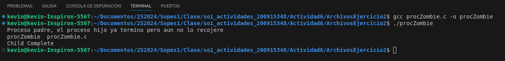

|              |                |
|    :---      |      ---:      |
| Nombre: Kevin Martin Samayoa Urizar | Curso: Sistemas Operativos 1 |
| Carnet: 200915348                   | Fecha: 12/09/2024            |

# ACTIVIDAD 6

## Contenido
- [Ejercicio 1](#ejercicio1)
- [Ejercicio 2](#ejercicio2)
- [Ejercicio 3](#ejercicio3)
    - [Codigo original](#original)
    - [Codigo corregido](#correccion)
    - [Explicación](#explicacion)
    - [Salida](#resultados)
    - [Capturas](#capturas)

---

<a name="ejercicio1"></a>
## Ejercicio 1: Análisis
¿Incluyendo el proceso inicial, cuantos procesos son creados por el siguiente programa?
Razone su respuesta.

```
    #include <stdio.h>
    #include <unistd.h>

    int main(){
        /* fork a child process */
        fork();

        /* fork another child process */
        fork();

        /* and fork another */
        fork();

        return 0; 
    }
```

Respuesta: 
* En el primer fork se crea un proceso hijo ademas del proceso inicial. P = inicial, P1 = primer proceso.

* En el segundo fork, los dos procesos existentes ejecutan el fork por lo que se duplican, entonces hay 4 procesos. P, P1, P2 y P3.

* En el tercer fork, los 4 procesos ejecutan el fork creando un subproceso cada uno. Por lo tanto existen: P, P1, P2, P3, P4, P5, P6 Y P7

Conclusion: Se crean 8 procesos en total. El inicial (se incluye) y otros 7 mas.

<a name="ejercicio2"></a>
## Ejercicio 2: Proceso Zombie

Ejecucion del programa mostrando un proceso zombie

* Proceso esperando 60 esgundos


* Proceso terminado despues de los 60 segundos


* Estado por el comando ps -l


* Salida donde se puede ver el proceso zombie


<a name="ejercicio3"></a>
## Ejercicio 3: Procesos e hilos únicos

<a name="original"></a>
### Codigo original

```
    pid_t pid;

    pid = fork()
    if (pid == 0) { /*child process */
        fork();
        thread_create( ...);
    }
    fork();
```

<a name="correccion"></a>
### Codigo corregido

 ```
    void* thread_function(void *arg) {
        printf("H. Hilo creado en el proceso: %d, ID del hilo: %lu\n", getpid(), pthread_self());
    }

    int main() {
        pid_t pid;
        pthread_t thread_id;

        printf("P. Proceso inicial PID: %d\n", getpid());

        pid = fork();
        if (pid == 0) { // Proceso hijo
            printf("P. Proceso hijo PID: %d, padre PID: %d\n", getpid(), getppid());

            pid_t child_pid = fork();
            if (child_pid == 0) { // Hijo del hijo
                printf("P. Hijo del hijo PID: %d, padre PID: %d\n", getpid(), getppid());
            }
            // Esto lo ejecuta el proceso hijo y el hijo del hijo
            pthread_create(&thread_id, NULL, thread_function, NULL);
        } else {
            wait(NULL);
        }

        // El proceso padre original, el primer hijo y el hijo del hijo pasan por aca
        pid = fork();
        if (pid == 0) { // Nuevo proceso hijo
            printf("P. Nuevo proceso hijo PID: %d, padre PID: %d\n", getpid(), getppid());
        } else {
            wait(NULL);
        }

        return 0;
    }
```

<a name="explicacion"></a>
### Explicación

* Para lograr que el codigo funcione, se crea una variable de tipo `pthread_t`, en este caso la llamamos `thread_id` quedando de la siguiente forma `pthread_t thread_id;`.

    Se imprime el proceso inicial, luego con el `fork` se clona y se crea el proceso hijo por lo que hasta ahora existen 2 procesos. Luego se crea otro fork para el hijo con `pid_t child_pid` y con esto se acumulan 3 procesos. y luego se genera 2 hilos por medio de `pthread_create`. Los hilos son por el hijo del hijo y por el hijo.

    Debido a que cada `fork` clona el proceso padre, los tres procesos deben llegar al ultimo fork y este genera un proceso nuevo por cada uno que llego, lo que produce un total de 6 procesos. y los hilos mueren al terminar la ejecucion del metodo `thread_function` por lo que solo se generaron dos hilos en toda la ejecucion, uno por el proceso "hijo" y otro por el proceso "hijo del hijo". 

* Tomando en cuenta los `fork` utilizados y su comportamiento podemos calcular que se generan tres proceso y al final estos se duplican, generando así un total de 6 procesos.

* Para el número de hilos únicos, solo se cuenta el número de llamadas a `pthread_create()`, y como se puede ver en el código, este se llama dos veces, uno por el proceso "nieto" y otro por el proceso "hijo".

<a name="resultados"></a>
### Resultados

a) ¿Cuántos procesos únicos son creados? R// 6

b) ¿Cuántos hilos únicos son creados? R// 2

<a name="capturas"></a>
### Capturas

Se muestra una captura de la salida del código

