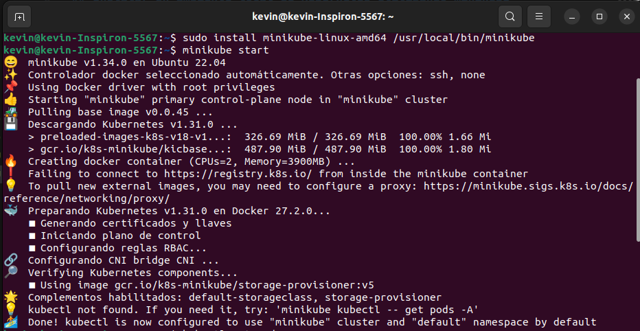

|              |                |
|    :---      |      ---:      |
| Nombre: Kevin Martin Samayoa Urizar | Curso: Sistemas Operativos 1 |
| Carnet: 200915348                   | Fecha: 10/10/2024            |

# ACTIVIDAD 8

## Instalar un ambiente local de Kubernetes utilizando minikube

1. Instalar Minikube utilizando un basj en linux
    
    `curl -LO https://storage.googleapis.com/minikube/releases/latest/minikube-linux-amd64`

    `sudo install minikube-linux-amd64 /usr/local/bin/minikube`

     

2. Iniciar Minikube
    `minikube start`
     

3. Verificar que el clúster esté funcionando
    `kubectl get nodes`

    Nota: si se obtiene el siguiente error
    

    Resolver de la siguiente manera:

    3.1 Descargar el binario de kubectl
        `curl -LO "https://dl.k8s.io/release/$(curl -L -s https://dl.k8s.io/release/stable.txt)/bin/linux/amd64/kubectl"`
    
    3.2 Volver ejecutable el binario
        `chmod +x ./kubectl`

    3.3 Mover el binario al PATH
        `sudo mv ./kubectl /usr/local/bin/kubectl`
    
    3.4 Verificar la instalación
        `kubectl version --client`
    
    

    Captura con la verificación correcta que el cluster esta funcionando

    

## Despliegue de Nginx

1. Crear el despliegue de Nginx con `kubectl create deployment nginx --image=nginx`

2. Exponer el despliegue con `kubectl expose deployment nginx --type=NodePort --port=80`
    
3. Obtener la URL del servicio con `minikube service nginx --url`

4. Visistar la ruta para ver el despliegue del contenedor web server Nginx

## Pregunta

¿En un ambiente local de Kubernetes existen los nodos masters y workers, como es que esto funciona?

Los conceptos se mantienen, pero en un entorno de producción, los nodos se dividen fisicamente o virtualmente en `Master` o `Worker`. En el entorno local todo el clúster se ejecuta en un solo nodo que funciona como ambos simulandolos roles del `Master` y `Worker`.